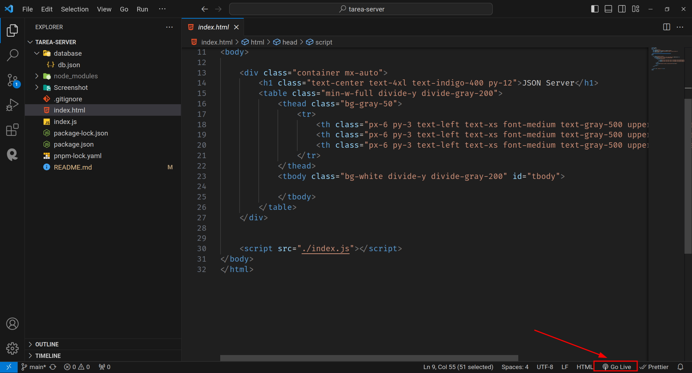
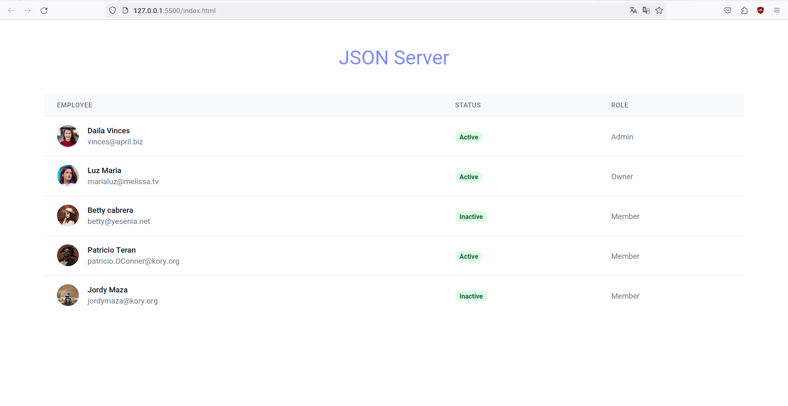

# Proyecto de Evaluación: API Simulada con JSON Server

Este proyecto es una implementación de una API simulada utilizando [JSON Server](https://github.com/typicode/json-server) en JavaScript. JSON Server es una herramienta que nos permite crear rápidamente una API RESTful utilizando un archivo JSON como fuente de datos 🚀.

## Objetivo

El objetivo principal de este proyecto es mostrar mi capacidad para crear y utilizar una API simulada en una aplicación web utilizando JSON Server. Este proyecto se ha desarrollado como parte de una evaluación y demuestra mis habilidades en las siguientes áreas:

- Creación y configuración de una API RESTful simulada
- Consumo de datos de la API en una aplicación web utilizando JavaScript.
- Manipulación de datos JSON para interactuar con la API.
- Uso de GitHub para gestionar y documentar el proyecto.

### Tecnologías Utilizadas

El proyecto utiliza las siguientes tecnologías y herramientas:

- JavaScript
- JSON Server
- HTML y CSS (si es necesario para la interfaz de la aplicación)
- Git y GitHub para el control de versiones y documentación del proyecto.

## Author

- [@Jordy Maza](https://github.com/jamaza7)

## Tabla de Contenidos

- [Instalación](#instalación)
- [Configuracion](#configuracion)
- [Créditos](#créditos)
- [Licencia](#licencia)

## Instalación

> **Nota:** Para ejecutar este proyecto debera tener instalado nodejs en la version **LTS** o posteriores

Clone el repositorio desde Github

```bash
    git clone https://github.com/jamaza7/evaluation-project-backend.git
    cd evaluation-project-backend
```

Al estar dentro del directorio indicado ejecute el siguiente comando para instalar dependecias

```javascript
    npm install
```

## Configuracion

Para iniciar la api simulada debemos inicar el servidor con el comando

```javascript
    npm start
```

Luego de eso debera iniciar el frontend con la extención **[live server](https://github.com/ritwickdey/vscode-live-server)**, dirigase a su `index.html` y vera en su parte inferior un icono en el cual debera dar click



Al abrir **live-server** obtendra en la pantalla de su navegador la aplicacion lista



## Créditos

Agradecimientos al **Mgs. Patricio Vaca Esbocar** por
su orientación y apoyo valioso durante este perido academico 💯.

## Licencia

[MIT](https://choosealicense.com/licenses/mit/)
